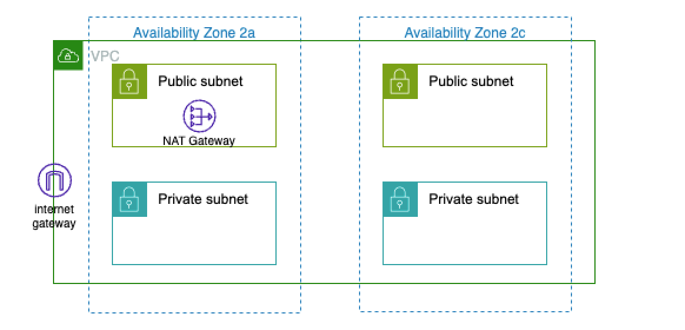

# 개요
* 테라폼으로 EKS 생성

# 전제조건
* Administrator Policy를 갖는 AWS Profile(장애 데모여서 권한 제어는 하지 않았음)

# 네트워크 토폴로지




# 생성 방법
*  terraform apply는 timeout 발생(ECR image pull에러 때문에)

```bash
terraform init
terraform apply
```


# 삭제 방법

```bash
terrform destroy
```
